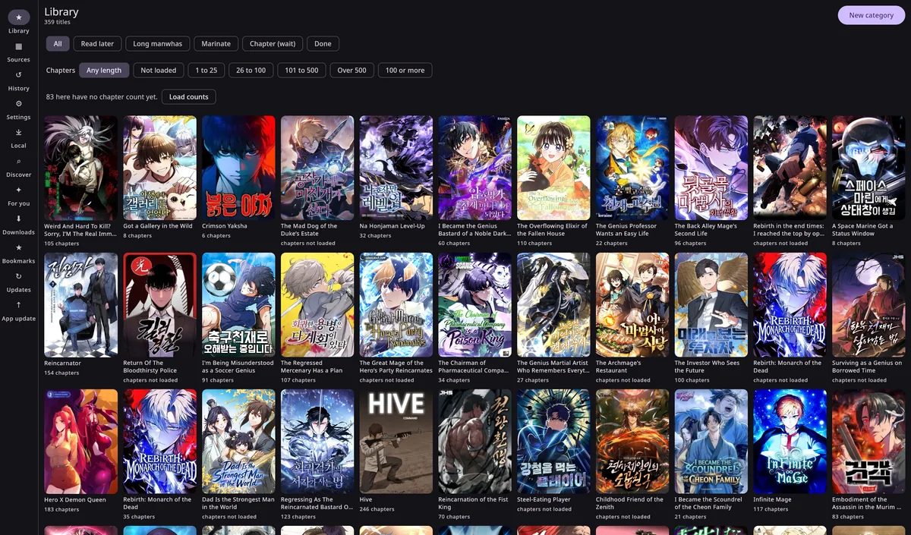
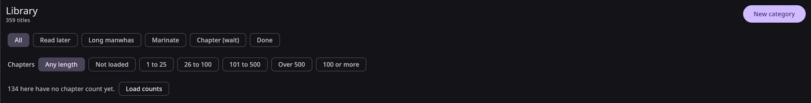

<p align="center">
  
</p>

<h1 align="center">DropSauce</h1>

<p align="center">
  A lightweight, modern comic and novel reader for Android with a beautiful Material 3 Expressive design. Supports Mihon and LNReader extensions.
</p>

<p align="center">
  <a href="https://github.com/byteoverride/DropSauce-desktop/releases/latest"></a>
  <a href="https://discord.com/channels/1435615296202477581/1435650246163169382/1435651186140119091"></a>
  <a href="https://github.com/byteoverride/DropSauce-desktop/releases"></a>
  <a href="LICENSE"></a>
</p>

<p align="center">
  <a href="https://developer.android.com/"></a>
  <a href="https://kotlinlang.org/"></a>
  <a href="https://developer.android.com/compose"></a>
  <a href="https://m3.material.io/"></a>
</p>

<p align="center">
  <a href="https://github.com/byteoverride/DropSauce-desktop/releases/latest"><strong>Download APK</strong></a>
  |
  <a href="https://drop-sauce.app"><strong>Website</strong></a>
  |
  <a href="https://discord.com/channels/1435615296202477581/1435650246163169382/1435651186140119091"><strong>Discord</strong></a>
  |
  <a href="https://github.com/byteoverride/DropSauce-desktop/issues"><strong>Issues</strong></a>
</p>

---

> ## This is a fork
>
> This repository is a fork of **[DropSauce](https://github.com/HuzaifaKhalid1311/DropSauce)**
> by HuzaifaKhalid1311, which is itself derived from
> [Kotatsu](https://github.com/KotatsuApp/Kotatsu). Maintained here by
> [byteoverride](https://github.com/byteoverride).
>
> **What this fork adds:** a Compose Multiplatform **Linux desktop** application, built
> from the same source tree and sharing its database and logic. See
> [Linux desktop](#linux-desktop) below.
>
> The Android app is upstream's work and is **not** released from this fork. For Android
> builds, the website, the Discord and the community, go to the
> [upstream project](https://github.com/HuzaifaKhalid1311/DropSauce).
>
> GPL-3.0, same as upstream. Changes are recorded in the git history and in `DECISIONS.md`.

---

## About

DropSauce is a free and open-source comic and novel reader for Android, built to feel quick, clean, and comfortable to use with a lot of features

⭐Please give the repo a star if you like the project. It helps more people find it.🌟

## Screenshots

<p align="center">
  
  
  
  
  
  
</p>

<p align="center">
  <sub>Favorites | Details | Manga/Webtoon Reader | Novel Reader | Extensions | Settings</sub>
</p>

## Highlights
- Full novel reading support alongside manga, including offline EPUB file importing.
- Multi-source extension engine supporting LNReader JS plugins and Tsundoku APK extensions.
- Lightweight Android-first experience with a modern, polished interface.
- Rich extension support with library, reading, history, bookmarks, tracking, stats, and settings tools.
- Google Drive sync, local backup/restore, and in-app updates to keep your setup moving with you.
- Supports Kotatsu and Mihon backup restoration alongside google drive sync
- Free and open-source under the GPLv3 license.

<details>
<summary><strong>Features</strong></summary>

- Comfortable manga, webtoon and novel reading experience with configurable reader behavior, haptics, and zoom gestures.
- EPUB novel importing for offline reading.
- Extensive extension ecosystem supporting native extensions, LNReader JS plugins, and Tsundoku APK extensions.
- Reverse tracking integration with a redesigned tracking menu.
- Favorites, history, bookmarks, tracking, stats, and categories to keep your library organized.
- Google Drive sync for library, history, bookmarks, tracking, stats, settings, and covers.
- Local backup and restore system for moving or protecting your setup.
- Material 3 Expressive details page for clear and quick overview
- New onboarding/welcome flow with sync and restore setup.
- Android widgets for continue reading, favorites, and reading stats.
- PDF import support, converting PDFs into readable CBZ chapters.
- App lock with biometric or device credential support.
- Downloads for offline reading when a source supports it.
- In-app updates, with APKs also published through GitHub Releases.

</details>

<details>
<summary><strong>Recent improvements</strong></summary>

- Full novel support with offline EPUB file importing.
- LNReader JS plugin and Tsundoku APK extension support.
- Interactive zoom gestures in novel reading mode.
- Added reverse tracking and refreshed tracking menu design.
- New popup animations across app flows.
- Redesigned list options, filter menu, and progress tracking.
- Minor UI improvements, edge-case crash fixes, and release build cleanups.

</details>

## Star History

<a href="https://www.star-history.com/?repos=byteoverride%2FDropSauce-desktop&type=date&legend=top-left">
 <picture>
   <source media="(prefers-color-scheme: dark)" srcset="https://api.star-history.com/chart?repos=byteoverride/DropSauce-desktop&type=date&theme=dark&legend=top-left&sealed_token=WCXLPn5xBgloSjmN1d0FVz4b_AhpF7pqchA72IfTFnB7loTdSNmldj4dtjRPvy25mzYWw0HbOjwW5-L3IIKZPiwQNn6MXISsmwmCuCXLybr-2c5ByQ_Ycg" />
   <source media="(prefers-color-scheme: light)" srcset="https://api.star-history.com/chart?repos=byteoverride/DropSauce-desktop&type=date&legend=top-left&sealed_token=WCXLPn5xBgloSjmN1d0FVz4b_AhpF7pqchA72IfTFnB7loTdSNmldj4dtjRPvy25mzYWw0HbOjwW5-L3IIKZPiwQNn6MXISsmwmCuCXLybr-2c5ByQ_Ycg" />
   
 </picture>
</a>

## Linux desktop

A native desktop build of the reader, written in Compose Multiplatform. It is a second
front end over the same shared logic, not a rewrite, and the Android app still builds
untouched.

<p align="center">
  
</p>

<p align="center">
  <sub>The library on Linux, filtered by category and by length</sub>
</p>

### Filtering a shelf by length

The library filters by how many chapters a title has, which is the quick way to find the
ones on a "read it once it is long enough" shelf that have grown past your threshold.

<p align="center">
  
</p>

Counts are read from the database, not fetched while you scroll. They get there three
ways:

- **From your reading history, at startup.** Free, local, no requests. If you have read a
  title, the app already knows how long it was.
- **From opening, reading or tracking a title**, as before.
- **From the Load counts button**, for everything else. A title you have never opened has
  no count anywhere on your machine, and the only way to learn one is to ask the source.
  That runs on a button rather than on its own, scoped to the category you have selected,
  four requests at a time, and you can stop it.

The bar says how many titles in view still have no count, so an empty result never leaves
you guessing whether nothing matched or nothing had been counted yet.

Buckets run 1 to 25, 26 to 100, 101 to 500 and Over 500, plus **100 or more**, which
deliberately overlaps the others because emptying a shelf at a threshold is a different
question from browsing one. Once filtered, the whole set can be moved into another
category in one step.

### Install

Grab `dropsauce_<version>_amd64.deb` from the
[latest release](https://github.com/byteoverride/DropSauce-desktop/releases/latest):

```bash
sudo dpkg -i dropsauce_*_amd64.deb
```

Around 66 MB, installs to `/opt/dropsauce`, and bundles its own Java runtime, so it does
not care what Java you have. Remove it with `sudo dpkg -r dropsauce`.

Your library lives in `~/.local/share/dropsauce/`. Copy that directory somewhere safe
before trying a new build if you care about what is in it.

### What it does

Library with categories, catalogue browsing and search, a webtoon reader, reading
history, bookmarks, downloads for offline reading, importing local comics (CBZ and EPUB),
backup and restore that round-trips with the Android app, reading statistics, duplicate
and category cleanup tools, and optional AniList or MyAnimeList tracking.

Sources come from the `kotatsu-parsers` catalogue. Mihon extension APKs and LNReader JS
plugins are Android-only and are **not** available on desktop.

### Staying up to date

The app checks this repository's releases once when it starts and puts a dot on the
**App update** item in the sidebar when there is a newer build. That screen shows what
changed and links to the package.

It does not download or install anything for you. A `.deb` needs root, so the install
stays yours to run. The only request it makes is to GitHub's public releases API, once
per launch.

### Build it yourself

```bash
./gradlew :desktop:run          # run it
./gradlew :desktop:packageDeb   # build the .deb
```

Needs JDK 21. `dpkg-deb` and `fakeroot` are required for `packageDeb` and are already
present on a normal Debian or Ubuntu install. The Android SDK is only needed for `:app`.

### Known limits

- Linux x86_64 only. No Windows or macOS packaging is set up.
- Wayland runs through XWayland, since the app renders into an AWT window.
- The reader is webtoon mode only. Paged modes are not implemented.
- Very tall strips decode whole, as tiled decoding is not implemented yet.
- AVIF pages and CBR archives cannot be decoded.
- Tracking needs your own AniList or MyAnimeList OAuth application. No keys ship in the
  source, and a service with nothing configured says so instead of failing oddly.

Full detail, including where every file is written, is in
[README-DESKTOP.md](README-DESKTOP.md).

## Install

1. Open the [latest GitHub release](https://github.com/byteoverride/DropSauce-desktop/releases/latest).
2. Download the newest `DropSauce` APK.
3. Install it on a compatible Android device.
4. Add your preferred source or extension repository, then start reading.

Android may ask you to allow installs from your browser or file manager. That is normal for APKs downloaded outside the Play Store.

## FAQ

### Does DropSauce include manga or novels?
> No. DropSauce does not include built-in content. Sources are provided through external libraries, JS plugins, or repositories added by users.

### Is DropSauce free?
> Yes. DropSauce is free and open source under the GPLv3 license.

### How do updates work?
> DropSauce supports in-app updates, and release APKs are also published on GitHub. You can update from inside the app or install the latest APK from the Releases page.

### Can I contribute?
> Yes. Pull requests for patches, fixes, and new features are welcome.

## Project structure

```plaintext
app/src/main/
├── kotlin/org/koitharu/kotatsu/
│   ├── core/          # Shared database, network, parser, preferences, UI, and utility code
│   ├── main/          # App entry points, main activity, and app-level screens
│   ├── reader/        # Manga and novel reader UI and reading behavior
│   ├── details/       # Manga and novel details, chapters, metadata, and related services
│   ├── explore/       # Browse and discovery screens
│   ├── search/        # Search screens and search flows (with Manga/Novel toggle)
│   ├── favourites/    # Favorites and library-facing flows
│   ├── history/       # Reading history and progress
│   ├── download/      # Offline downloads and download queue
│   ├── extensions/    # Extension browsing, JS plugins, and APK extension management
│   ├── lnreader/      # LNReader JS plugin integration
│   ├── mihon/         # Mihon & Tsundoku APK extension integration
│   ├── backup/        # Local backup and restore
│   ├── sync/          # Sync data, domain, UI, and workers
│   ├── tracker/       # Tracking integrations and reverse tracking
│   ├── widget/        # Android home screen widgets
│   └── settings/      # Settings screens and preferences
└── res/
    ├── drawable*/     # Icons, backgrounds, and app artwork
    ├── layout*/       # XML screens, widgets, and reusable layouts
    ├── mipmap*/       # Launcher icons
    ├── values*/       # Strings, colors, themes, and translations
    └── xml/           # Android XML configuration
```

## Contribute

You can send a Pull Request for your patches, fixes, or new features here.

1. Fork the repository.
2. Create a focused branch for your change.
3. Build locally with `./gradlew :app:assembleDebug`.
4. Open a Pull Request with a short explanation of what changed.

Small fixes are welcome. Clear screenshots or short screen recordings are extra helpful for UI changes.

## Credits

DropSauce exists because of the work already done by the open-source Android manga reader community.

Built on top of [DropSauce](https://github.com/HuzaifaKhalid1311/DropSauce) by HuzaifaKhalid1311, which this repository forks.

Special thanks to the original [Kotatsu](https://github.com/KotatsuApp/Kotatsu) developers, [LNReader](https://github.com/LNReader/lnreader) developers, and the [Mihon](https://github.com/mihonapp/mihon) developers/community for the ideas, code, source ecosystem, and long-running maintenance work that helped shape projects like this.

## Certificate fingerprints

> These are the **upstream** project's Android signing certificates. This fork releases the Linux desktop `.deb` only and publishes no signed APK, so nothing downloaded from here will match them.

<div align="left">

SHA1:

```plaintext
9A:11:C9:FC:90:C6:E4:3F:7B:D4:2B:44:A3:37:D0:85:E6:E3:27:27
```

SHA256:

```plaintext
B8:4B:C7:C7:0A:5C:B0:BF:EA:9D:EA:D9:E0:5F:00:52:CB:A1:38:4C:AE:F5:97:71:3F:27:52:E4:3F:C9:63:18
```

</div>

## License

[](http://www.gnu.org/licenses/gpl-3.0.en.html)

<div align="left">

All programs from DropSauce™ project are free, open-source programs under the GPL license. You may copy, distribute, and modify the software as long as you keep track of changes/dates in the source files. Any modifications to the software, including code licensed under the GPL (via a compiler), must also be provided under the GPL license.

</div>

## Disclaimer

<div align="left">

The developer(s) of this application do not have any affiliation with the content providers available. If there is any content, it is provided by external libraries added or imported by users; the application itself does not include any built-in content.

</div>
